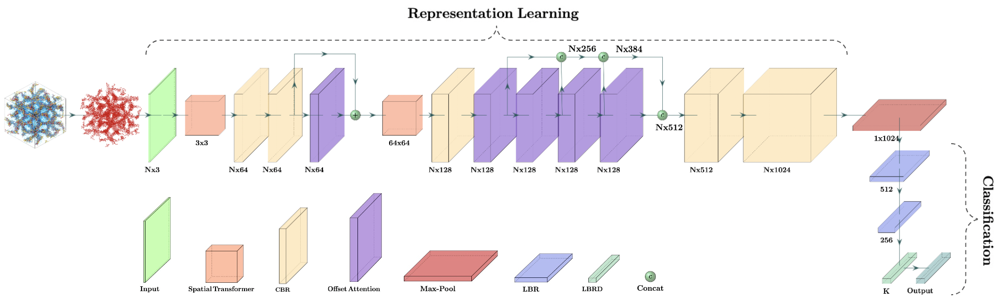

# nets.phasedetection

- [About This Project](#about-this-project)
  - [Publication Detail](#publication-detail)
  - [Relevant Work](#relevant-work)
- [Getting Started](#getting-started)
  - [Prerequisites](#prerequisites)
  - [Data Downloads](#data-downloads)
- [Usage](#usage)
  - [Data Preprocessing](#data-preprocessing)
- [Training](#training)
- [Results](#results)
  - [Test Accuracy](#test-accuracy)
  - [Confusion Matrices](#confusion-matrices)
  - [Model Downloads](#model-downloads)
- [Contributing](#contributing)
- [Reference](#reference)
- [Citation](#citation)

## About This Project



### Publication Detail

Available soon.

### Relevant Work

Available soon.

## Getting Started

### Prerequisites

  ```sh
  conda create -n nets python=3.9
  conda activate nets

  pip install -r requirements.txt
  ```

### Data Downloads

Available soon.

## Usage

### Data Preprocessing

- Generate point clouds (normalized coordinates of minority components) from original `.pdb` files (simulation frames)

  ```sh
  cd ./data
  python process_pdb.py -c LAM -t -r
  ```

  -c: name of the phases available form `.pdb` files (BCC, DIS, HPC, HPL, or LAM)\
  -t: perform random translations of point clouds wrapped by periodic boundary conditions\
  -r: perform random uniform rotations of point clouds wrapped by periodic boundary conditions

- Generate train/test split json files

  ```sh
  cd ./data/point_clouds/train_test_split
  python split.py --train_ratio 0.8 --num_points 3000 --phases 'lam' 'hpc' 'hpl'
  ```

  train_ratio: train data split ratio (default: 0.8)\
  num_points: number of point clouds for each phase (default: 3000)\
  phases: names of different possible phases (default: 'lam' 'hpc' 'hpl' 'bcc' 'dis' 'dg')

### Training

- Train the PointNet using preprocessed data:

  ```sh
  cd ./utils
  python train_classification.py -b 128 -n 1024 -e 250 -d ../data/point_clouds/ -m PointNet -r -lr 0.0001
  ```

  -b: batch size\
  -n: number of points selected from each point cloud, so that the input point clouds will have uniform dimension n*3\
  -e: number of training epochs\
  -d: data path\
  -m: choose one of the models `PointNet` or `PCCT` to use\
  -r: use `random sampling` otherwise it uses `FPS` to select points from each point cloud\
  advanced options\
  -w: number of subprocesses|workers to use for data loading\
  -o: output folder name\
  -l: load model from a saved model path\
  -f: use feature transform\
  -c: save critical points in numpy arrays\
  -s: seed (manual random seed)\
  -p: preprocess the data before training starts\
  -lr: Adam optimizer learning rate\

## Results

The highest accuracy and the corresponding confusion matrices for different models:

### Test Accuracy

Available soon.

### Confusion Matrices

Available soon.

### Model Downloads

Available soon.

## Contributing

Any contributions you make are **greatly appreciated**.

1. Fork the Project
2. Create your Feature Branch (`git checkout -b feature/AmazingFeature`)
3. Commit your Changes (`git commit -m 'Add some AmazingFeature'`)
4. Push to the Branch (`git push origin feature/AmazingFeature`)
5. Open a Pull Request

Project Link: [github.com/hoshy001/nets.phasedetection](https://github.com/hoshy001/nets.phasedetection)

## Reference

1. C. R. Qi, H. Su, K. Mo and L. J. Guibas, PointNet: Deep Learning on Point Sets for 3D Classification and Segmentation. _Proceedings of the IEEE Conference on Computer Vision and Pattern Recognition_, **2017**, 652–660. [[link](https://arxiv.org/abs/1612.00593)]
2. Z. Shen, Y. Sun, T. P. Lodge, and J. I. Siepmann, Development of a PointNet for Detecting Morphologies of Self-Assembled Block Oligomers in Atomistic Simulations, _J. Phys. Chem. B_, **2021**, _125_, 5275−5284. [[link](https://pubs.acs.org/doi/10.1021/acs.jpcb.1c02389)]
3. M. H. Guo, J. X. Cai, Z. N. Liu, T. J. Mu, R. R. Martin, and S. M. Hu, PCT: Point cloud transformer, _Computational Visual Media_, **2021**, _7_, 187–199. [[link](https://link.springer.com/article/10.1007/s41095-021-0229-5)]
4. X. Wu, L. Xinyi, W. Junfei, L. Zhongyuan, Z. Jing, and L. Xia, Point cloud classification based on transformer. _Computers and Electrical Engineering_, **2022**, _104_, 108413. [[link](https://www.sciencedirect.com/science/article/pii/S0045790622006309)]
5. R. S. DeFever, C. Targonski, S. W. Hall, M. C. Smith, and S. Sarupria, A generalized deep learning approach for local structure identification in
molecular simulations, _Chem. Sci._ **2019**, _10_, 7503–7515. [[link](https://doi.org/10.1039/C9SC02097G)]


## Citation

Available soon.
